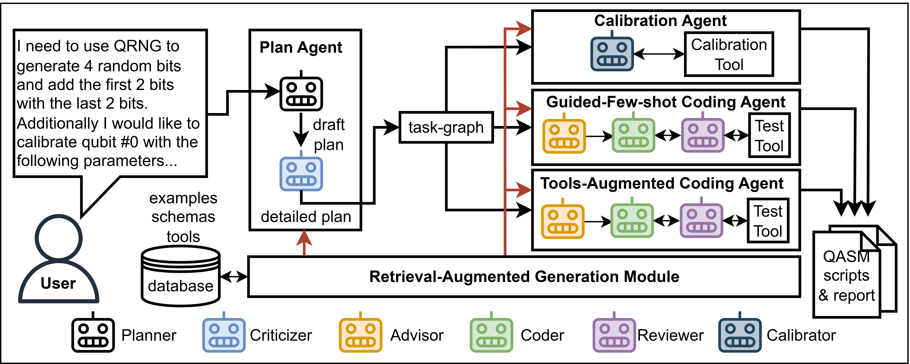
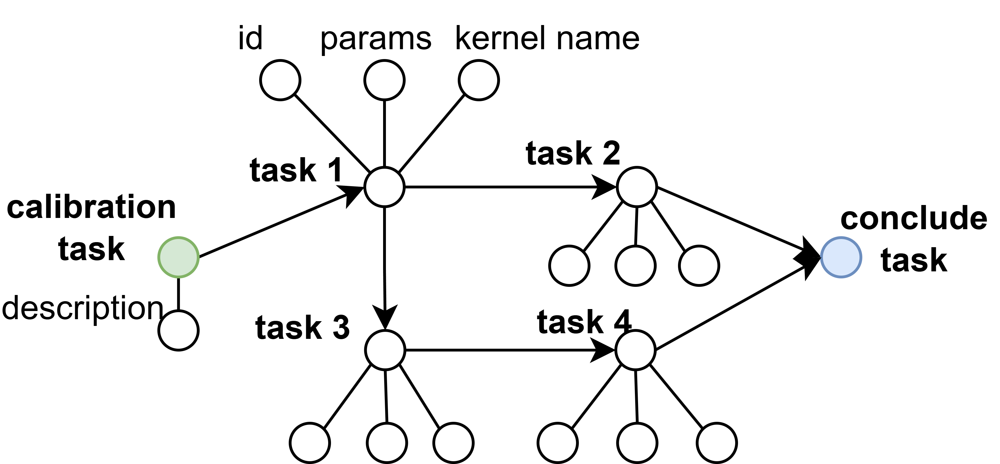

# QAgent: An LLM-based Multi-Agent System for Autonomous OpenQASM Programming

[](https://arxiv.org/abs/2508.20134)

This repository provides the **latest implementation of QAgent**, a multi-agent framework for autonomous OpenQASM programming.  
It corresponds to the paper:  
**[QAgent: An LLM-based Multi-Agent System for Autonomous OpenQASM Programming](https://arxiv.org/abs/2508.20134)**.  

**Note**: The arXiv paper has not yet been updated to reflect the newest version of the system. The manuscript is under revision, and this repository contains the most up-to-date code and workflow.  

---

## Contributions
QAgent introduces several key contributions:  

1. **Schema-aware planning and correction for quantum modules**  
   - Two-part planning agent (Planner + Criticizer) transforms high-level user goals into task graphs with schema-based validation and automatic corrections.  

2. **Agent routing strategy for OpenQASM generation**  
   - A routing mechanism assigns tasks to specialized coding agents (Guided Few-Shot Agent, Tools-Augmented Agent) based on quantum task complexity and the capability of LLM base models.  

3. **Automatic quantum hardware calibration**  
   - A Calibration Agent generates/edits device-specific calibration scripts, bridging high-level user intent with real-device execution constraints.  

4. **End-to-end workflow with structured reporting**  
   - Comprehensive reporting consolidates schemas, chosen strategies, calibration results, and generated OpenQASM code.  

---

## Workflow Overview


The workflow is composed of multiple collaborating agents:  

- **Plan Agent**: Decomposes user's request into sub-quantum-kernels. It first generates draft plan then revises it into a detailed & graph-based plan (with correct parameters).
  
- **Calibration Agent**: Calibrate the quantum backends based on user's request.  
- **Guided Few-Shot Coding Agent**: Handles common, well-structured kernels (quantum algorithms) with test-reflection loop.  
- **Tools-Augmented Coding Agent**: Handles tool-dependent，complicated, or novel kernels with test-reflection loop.  
- **Retrieval-Augmented Generation Module (RAG)**: Provides examples, schemas, and tools from the database to support planning and execution.  

The final output is a set of **OpenQASM scripts and reports** tailored to user requirements.  

---

## Coding Agent Workflow Loop
The coding workflow in QAgent follows an iterative **advisor–coder–reviewer** loop:

1. **Advisor** provides guidance and high-level strategies for code generation.  
2. **Coder** (coding agent) writes the corresponding OpenQASM code.  
3. The code is executed via **simulation and testing**.  
4. A structured **report** is generated with results and feedback.  
5. The **Reviewer** examines the output:  
   - If correct → the workflow proceeds.  
   - If incorrect → the reviewer provides feedback to the coder.  
6. The **Coder** refines or rewrites the code accordingly.  

## Example: `demo.py`
A good starting point is [`demo.py`](./demo.py).  

Running it will:  
- Generate **OpenQASM code** for the specified user requirements.  
- Produce two report files in the current directory:  
  - `demo_report.md` (human-readable report)  
  - `demo_report.json` (structured output)  

Both reports contain the full QASM code and calibration details satisfying the user query.  

## First-time setup
- Before running, unzip `kernels.zip` into the same directory:  
  ```bash
  unzip kernels.zip

- The Retrieval-Augmented Generation (RAG) step takes about 1–2 minutes during the first run.

## Environment Requirements
All dependencies are specified in [`env_requirement.yml`](./env_requirement.yml).  
You can set up the environment with:  

```bash
conda env create -f env_requirement.yml
conda activate qagent
```
## Citation
If you use this code, please cite:  

```bibtex
@article{qagent2025,
  title={QAgent: An LLM-based Multi-Agent System for Autonomous OpenQASM programming},
  author={Zhenxiao Fu, Fan Chen, Lei Jiang},
  journal={arXiv preprint arXiv:2508.20134},
  year={2025}
}
```
